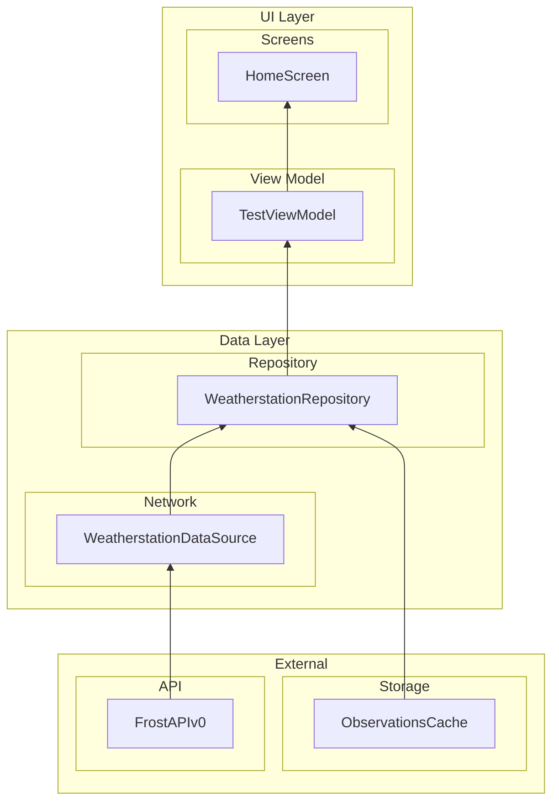

Arkitekturskisse
Blomster&Bier

```mermaid
    flowchart BT

    %% UI Layer
    subgraph uiLayer[UI Layer]

        subgraph screen[Screens]
            homeScreen[HomeScreen]
        end

        subgraph viewModel[View Model]
            testVM[TestViewModel]
        end
    end

    %% Data Layer
    subgraph dataLayer[Data Layer]
        subgraph dataRepo[Repository]
            weatherstationRepo[WeatherstationRepository]
        end

        subgraph network[Network]
            weatherstationDatasource[WeatherstationDataSource]
        end
    end

    %% External
    subgraph api[External]
        subgraph API[API]
            frostAPI[FrostAPIv0]
        end
        subgraph Storage[Storage]
            observationCache[ObservationsCache]
        end
    end

    %% VM -> UI
    testVM --> homeScreen

    %% Model/Repo -> ViewModel
    weatherstationRepo --> testVM

    %% Network -> Repo
    weatherstationDatasource --> weatherstationRepo

    %% External -> Network
    frostAPI --> weatherstationDatasource
    observationCache --> weatherstationRepo
```
