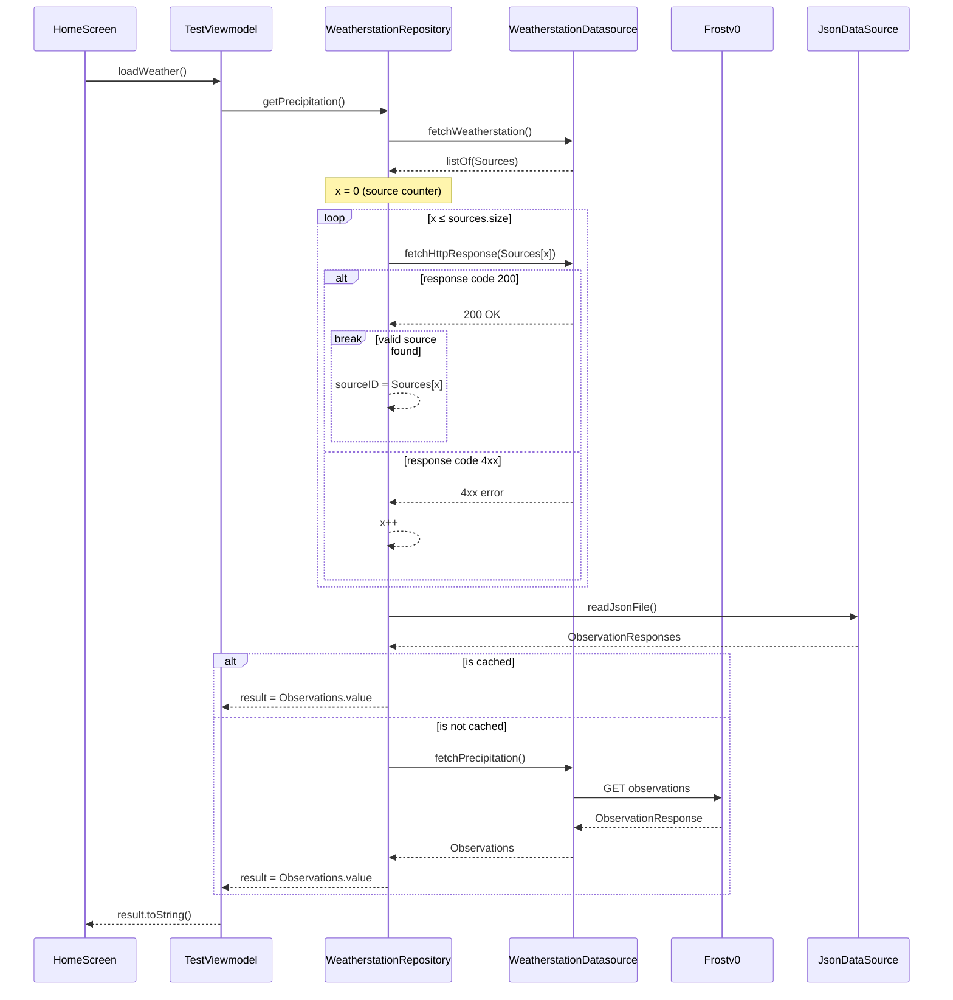

```mermaid
sequenceDiagram
  participant HS as HomeScreen
  participant VM as TestViewmodel
  participant Repo as WeatherstationRepository
  participant DS as WeatherstationDatasource
  participant F as Frostv0
  participant JD as JsonDataSource
  
  HS->>VM: loadWeather()
  VM->>Repo: getPrecipitation()
  Repo->>DS: fetchWeatherstation()
  DS-->>Repo: listOf(Sources)

  note over Repo: x = 0 (source counter)

  loop x ≤ sources.size
    Repo->>DS: fetchHttpResponse(Sources[x])
    alt response code 200
      DS-->>Repo: 200 OK
      break valid source found
        Repo-->>Repo: sourceID = Sources[x]
      end
    else response code 4xx
      DS-->>Repo: 4xx error
      Repo-->>Repo: x++
    end
  end

  Repo->>JD: readJsonFile()
  JD-->>Repo: ObservationResponses
  
  alt is cached
    Repo-->>VM: result = Observations.value
  else is not cached
    Repo->>DS: fetchPrecipitation()
    DS->>F: GET observations
    F-->>DS: ObservationResponse
    DS-->>Repo: Observations
    Repo-->>VM: result = Observations.value
  end
  VM-->>HS: result.toString()
```
