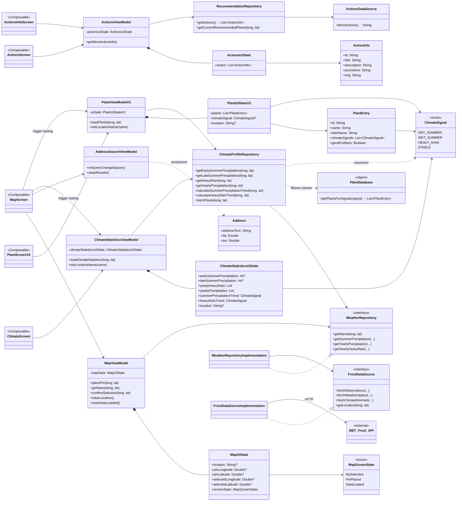

# Class diagram for use cases and sequence diagrams

```mermaid
classDiagram
    direction LR

    %% =====================
    %% UI-laget (skjermer)
    %% =====================
    class MapScreen {
        <<Composable>>
    }
    class ClimateScreen {
        <<Composable>>
    }
    class PlantScreenV2 {
        <<Composable>>
    }
    class ActionsScreen {
        <<Composable>>
    }
    class ActionsInfoScreen {
        <<Composable>>
    }

    %% =====================
    %% ViewModel-laget
    %% =====================
    class MapViewModel {
        -mapState: MapUiState
        +placePin(long, lat)
        +getName(long, lat)
        +confirmSelection(long, lat)
        +clearLocation()
        +markDataLoaded()
    }
    class MapUiState {
        +location: String?
        +pinLongitude: Double?
        +pinLatitude: Double?
        +selectedLongitude: Double?
        +selectedLatitude: Double?
        +screenState: MapScreenState
    }
    class MapScreenState {
        <<enum>>
        NoSelection
        PinPlaced
        DataLoaded
    }

    class AddressSearchViewModel {
        +onQueryChanged(query)
        +clearResults()
    }
    class Address {
        +addressText: String
        +lat: Double
        +lon: Double
    }

    class ClimateStatisticsViewModel {
        -climateStatisticsUiState: ClimateStatisticsUiState
        +loadClimateStatistics(long, lat)
        +setLocationName(name)
    }
    class ClimateStatisticsUiState {
        +earlySummerPrecipitation: Int?
        +lateSummerPrecipitation: Int?
        +yearlyHeavyRain: List
        +yearlyPrecipitation: List
        +summerPrecipitationTrend: ClimateSignal
        +heavyRainTrend: ClimateSignal
        +location: String?
    }

    class PlantViewModelV2 {
        -uiState: PlantUiStateV2
        +loadPlants(long, lat)
        +setLocationName(name)
    }
    class PlantUiStateV2 {
        +plants: List~PlantEntry~
        +climateSignal: ClimateSignal?
        +location: String?
    }

    class ActionsViewModel {
        -actionsUiState: ActionsUiState
        +getMoreActionInfo()
    }
    class ActionsUiState {
        +action: List~ActionInfo~
    }

    %% =====================
    %% Domain / Repository
    %% =====================
    class ClimateProfileRepository {
        +getEarlySummerPrecipitation(long, lat)
        +getLateSummerPrecipitation(long, lat)
        +getHeavyRain(long, lat)
        +getYearlyPrecipitation(long, lat)
        +calculateSummerPrecipitationTrend(long, lat)
        +calculateHeavyRainTrend(long, lat)
        +fetchPlants(long, lat)
    }

    class RecommendationRepository {
        +getActions(): List~ActionInfo~
        +getCurrentRecommendedPlants(long, lat)
    }

    class WeatherRepository {
        <<interface>>
        +getName(long, lat)
        +getSummerPrecipitation(...)
        +getYearlyPrecipitation(...)
        +getYearlyHeavyRain(...)
    }
    class WeatherRepositoryImplementation

    %% =====================
    %% DataSource-laget
    %% =====================
    class FrostDataSource {
        <<interface>>
        +fetchObservations(...)
        +fetchWeatherstation(...)
        +fetchClimateNormals(...)
        +getLocation(long, lat)
    }
    class FrostDataSourceImplementation

    class ActionsDataSource {
        +fetchActions(): String
    }

    class PlantDatabase {
        <<object>>
        +getPlantsForSignals(signal): List~PlantEntry~
    }

    %% =====================
    %% Modellklasser
    %% =====================
    class ActionInfo {
        +id: String
        +title: String
        +description: String
        +procedure: String
        +img: String
    }
    class PlantEntry {
        +id: String
        +name: String
        +latinName: String
        +climateSignals: List~ClimateSignal~
        +goodForBees: Boolean
    }
    class ClimateSignal {
        <<enum>>
        DRY_SUMMER
        WET_SUMMER
        HEAVY_RAIN
        STABLE
    }

    %% =====================
    %% Eksternt system
    %% =====================
    class MET_Frost_API {
        <<external>>
    }

    %% =====================
    %% Relasjoner
    %% =====================

    %% Skjerm bruker ViewModel
    MapScreen --> MapViewModel
    MapScreen --> AddressSearchViewModel
    MapScreen --> ClimateStatisticsViewModel : trigger lasting
    MapScreen --> PlantViewModelV2 : trigger lasting
    ClimateScreen --> ClimateStatisticsViewModel
    PlantScreenV2 --> PlantViewModelV2
    ActionsScreen --> ActionsViewModel
    ActionsInfoScreen --> ActionsViewModel

    %% ViewModel eier UiState
    MapViewModel *-- MapUiState
    MapUiState --> MapScreenState
    AddressSearchViewModel ..> Address : produserer
    ClimateStatisticsViewModel *-- ClimateStatisticsUiState
    PlantViewModelV2 *-- PlantUiStateV2
    ActionsViewModel *-- ActionsUiState

    %% ViewModel bruker repositories
    MapViewModel --> WeatherRepository
    ClimateStatisticsViewModel --> ClimateProfileRepository
    PlantViewModelV2 --> ClimateProfileRepository
    ActionsViewModel --> RecommendationRepository

    %% Repository-avhengigheter
    ClimateProfileRepository --> WeatherRepository
    ClimateProfileRepository ..> PlantDatabase : filtrerer planter
    RecommendationRepository --> ActionsDataSource
    WeatherRepositoryImplementation ..|> WeatherRepository
    WeatherRepositoryImplementation --> FrostDataSource

    %% DataSource-avhengigheter
    FrostDataSourceImplementation ..|> FrostDataSource
    FrostDataSourceImplementation --> MET_Frost_API : HTTP

    %% Modellbruk
    ActionsUiState --> ActionInfo
    PlantUiStateV2 --> PlantEntry
    PlantUiStateV2 --> ClimateSignal
    PlantEntry --> ClimateSignal
    ClimateStatisticsUiState --> ClimateSignal
    ClimateProfileRepository ..> ClimateSignal : returnerer
```
