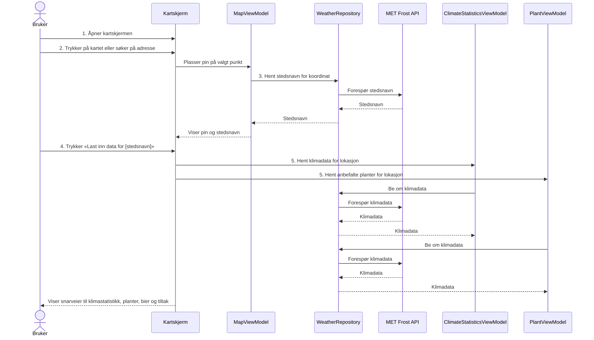

# Use Case 0 – Velg lokasjon

```mermaid
sequenceDiagram
    actor Bruker
    participant Kart as Kartskjerm
    participant MapVM as MapViewModel
    participant WeatherRepo as WeatherRepository
    participant Frost as MET Frost API
    participant ClimateVM as ClimateStatisticsViewModel
    participant PlantVM as PlantViewModel

    Bruker->>Kart: 1. Åpner kartskjermen
    Bruker->>Kart: 2. Trykker på kartet eller søker på adresse
    Kart->>MapVM: Plasser pin på valgt punkt
    MapVM->>WeatherRepo: 3. Hent stedsnavn for koordinat
    WeatherRepo->>Frost: Forespør stedsnavn
    Frost-->>WeatherRepo: Stedsnavn
    WeatherRepo-->>MapVM: Stedsnavn
    MapVM-->>Kart: Viser pin og stedsnavn

    Bruker->>Kart: 4. Trykker «Last inn data for [stedsnavn]»
    Kart->>ClimateVM: 5. Hent klimadata for lokasjon
    Kart->>PlantVM: 5. Hent anbefalte planter for lokasjon

    ClimateVM->>WeatherRepo: Be om klimadata
    WeatherRepo->>Frost: Forespør klimadata
    Frost-->>WeatherRepo: Klimadata
    WeatherRepo-->>ClimateVM: Klimadata

    PlantVM->>WeatherRepo: Be om klimadata
    WeatherRepo->>Frost: Forespør klimadata
    Frost-->>WeatherRepo: Klimadata
    WeatherRepo-->>PlantVM: Klimadata

    Kart-->>Bruker: Viser snarveier til klimastatistikk, planter, bier og tiltak
```
