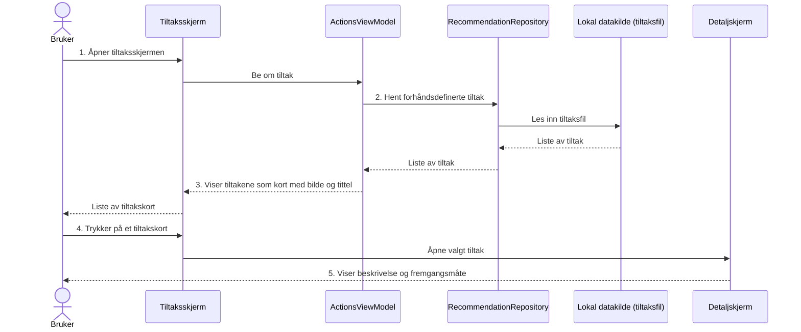

# Use Case 1 – Se tiltak for hagen mot styrtregn

```mermaid

sequenceDiagram
    actor Bruker
    participant Tiltak as Tiltaksskjerm
    participant ActionsVM as ActionsViewModel
    participant RecRepo as RecommendationRepository
    participant LokalData as Lokal datakilde (tiltaksfil)
    participant Detalj as Detaljskjerm

    Bruker->>Tiltak: 1. Åpner tiltaksskjermen
    Tiltak->>ActionsVM: Be om tiltak
    ActionsVM->>RecRepo: 2. Hent forhåndsdefinerte tiltak
    RecRepo->>LokalData: Les inn tiltaksfil
    LokalData-->>RecRepo: Liste av tiltak
    RecRepo-->>ActionsVM: Liste av tiltak
    ActionsVM-->>Tiltak: 3. Viser tiltakene som kort med bilde og tittel
    Tiltak-->>Bruker: Liste av tiltakskort

    Bruker->>Tiltak: 4. Trykker på et tiltakskort
    Tiltak->>Detalj: Åpne valgt tiltak
    Detalj-->>Bruker: 5. Viser beskrivelse og fremgangsmåte
```
