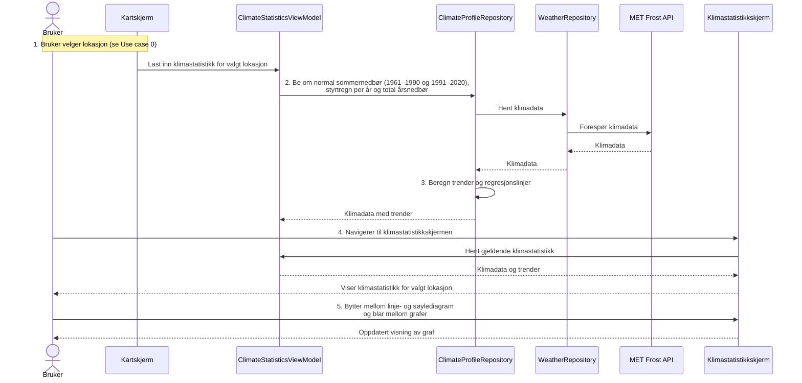

# Use Case 2 - Se klimastatistikk for valgt sted

```mermaid
sequenceDiagram
    actor Bruker
    participant Kart as Kartskjerm
    participant ClimateVM as ClimateStatisticsViewModel
    participant ClimateRepo as ClimateProfileRepository
    participant WeatherRepo as WeatherRepository
    participant Frost as MET Frost API
    participant KlimaSkjerm as Klimastatistikkskjerm

    Note over Bruker, Kart: 1. Bruker velger lokasjon (se Use case 0)

    Kart->>ClimateVM: Last inn klimastatistikk for valgt lokasjon
    ClimateVM->>ClimateRepo: 2. Be om normal sommernedbør (1961–1990 og 1991–2020), <br/> styrtregn per år og total årsnedbør
    ClimateRepo->>WeatherRepo: Hent klimadata
    WeatherRepo->>Frost: Forespør klimadata
    Frost-->>WeatherRepo: Klimadata
    WeatherRepo-->>ClimateRepo: Klimadata
    ClimateRepo->>ClimateRepo: 3. Beregn trender og regresjonslinjer
    ClimateRepo-->>ClimateVM: Klimadata med trender

    Bruker->>KlimaSkjerm: 4. Navigerer til klimastatistikkskjermen
    KlimaSkjerm->>ClimateVM: Hent gjeldende klimastatistikk
    ClimateVM-->>KlimaSkjerm: Klimadata og trender
    KlimaSkjerm-->>Bruker: Viser klimastatistikk for valgt lokasjon

    Bruker->>KlimaSkjerm: 5. Bytter mellom linje- og søylediagram <br/> og blar mellom grafer
    KlimaSkjerm-->>Bruker: Oppdatert visning av graf
```
