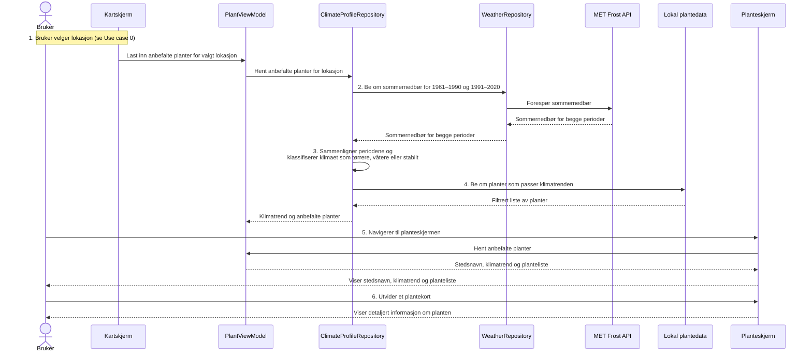

# Use Case 3 - Se anbefalte planter for lokalt klima

```mermaid
sequenceDiagram
    actor Bruker
    participant Kart as Kartskjerm
    participant PlantVM as PlantViewModel
    participant ClimateRepo as ClimateProfileRepository
    participant WeatherRepo as WeatherRepository
    participant Frost as MET Frost API
    participant PlanteData as Lokal plantedata
    participant PlanteSkjerm as Planteskjerm

    Note over Bruker, Kart: 1. Bruker velger lokasjon (se Use case 0)

    Kart->>PlantVM: Last inn anbefalte planter for valgt lokasjon
    PlantVM->>ClimateRepo: Hent anbefalte planter for lokasjon
    ClimateRepo->>WeatherRepo: 2. Be om sommernedbør for 1961–1990 og 1991–2020
    WeatherRepo->>Frost: Forespør sommernedbør
    Frost-->>WeatherRepo: Sommernedbør for begge perioder
    WeatherRepo-->>ClimateRepo: Sommernedbør for begge perioder
    ClimateRepo->>ClimateRepo: 3. Sammenligner periodene og <br/> klassifiserer klimaet som tørrere, våtere eller stabilt
    ClimateRepo->>PlanteData: 4. Be om planter som passer klimatrenden
    PlanteData-->>ClimateRepo: Filtrert liste av planter
    ClimateRepo-->>PlantVM: Klimatrend og anbefalte planter

    Bruker->>PlanteSkjerm: 5. Navigerer til planteskjermen
    PlanteSkjerm->>PlantVM: Hent anbefalte planter
    PlantVM-->>PlanteSkjerm: Stedsnavn, klimatrend og planteliste
    PlanteSkjerm-->>Bruker: Viser stedsnavn, klimatrend og planteliste

    Bruker->>PlanteSkjerm: 6. Utvider et plantekort
    PlanteSkjerm-->>Bruker: Viser detaljert informasjon om planten
```
