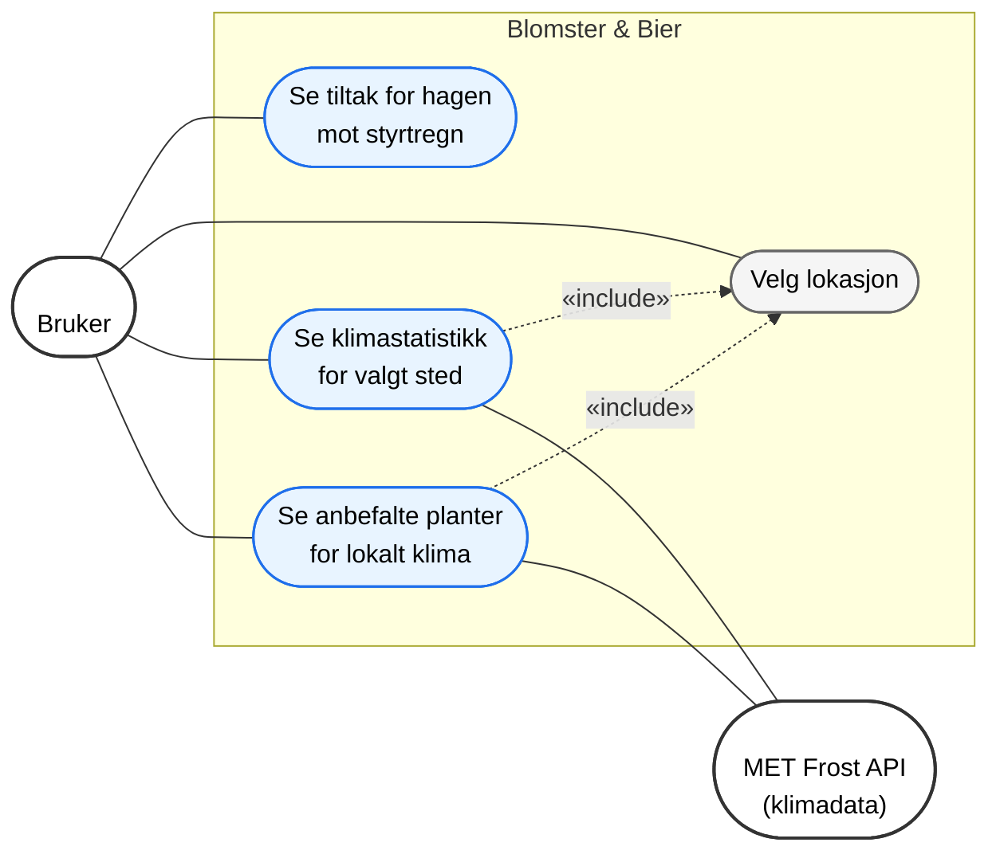

```mermaid
flowchart LR
    Bruker(["<br/>Bruker"])
    MET(["<br/>MET Frost API<br/>(klimadata)"])

    subgraph System["Blomster & Bier"]
        UC1(["Se tiltak for hagen<br/>mot styrtregn"])
        UC2(["Se anbefalte planter<br/>for lokalt klima"])
        UC3(["Se klimastatistikk<br/>for valgt sted"])
        UC0(["Velg lokasjon"])

        UC2 -. "«include»" .-> UC0
        UC3 -. "«include»" .-> UC0
    end

    Bruker --- UC1
    Bruker --- UC2
    Bruker --- UC3
    Bruker --- UC0

    UC2 --- MET
    UC3 --- MET

    classDef actor fill:#fff,stroke:#333,stroke-width:2px,color:#000
    classDef usecase fill:#e8f4ff,stroke:#1f6feb,stroke-width:1.5px,color:#000
    classDef shared fill:#f5f5f5,stroke:#666,stroke-width:1.5px,color:#000
    class Bruker,MET actor
    class UC1,UC2,UC3 usecase
    class UC0 shared
```
